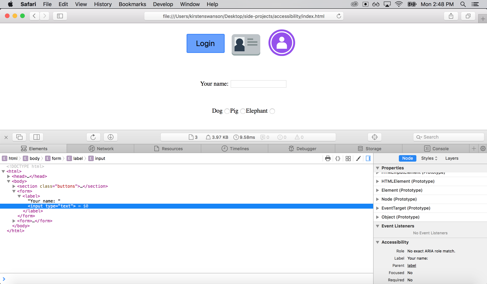
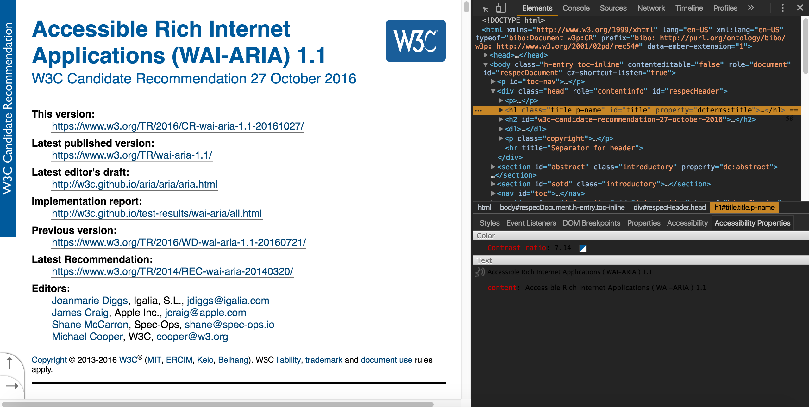
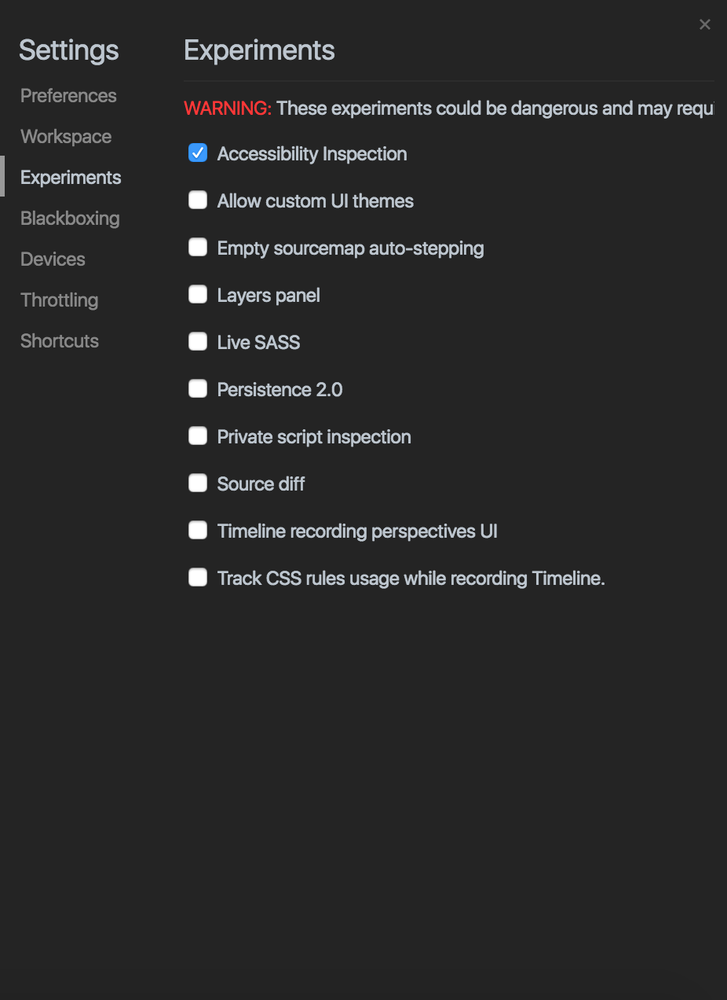
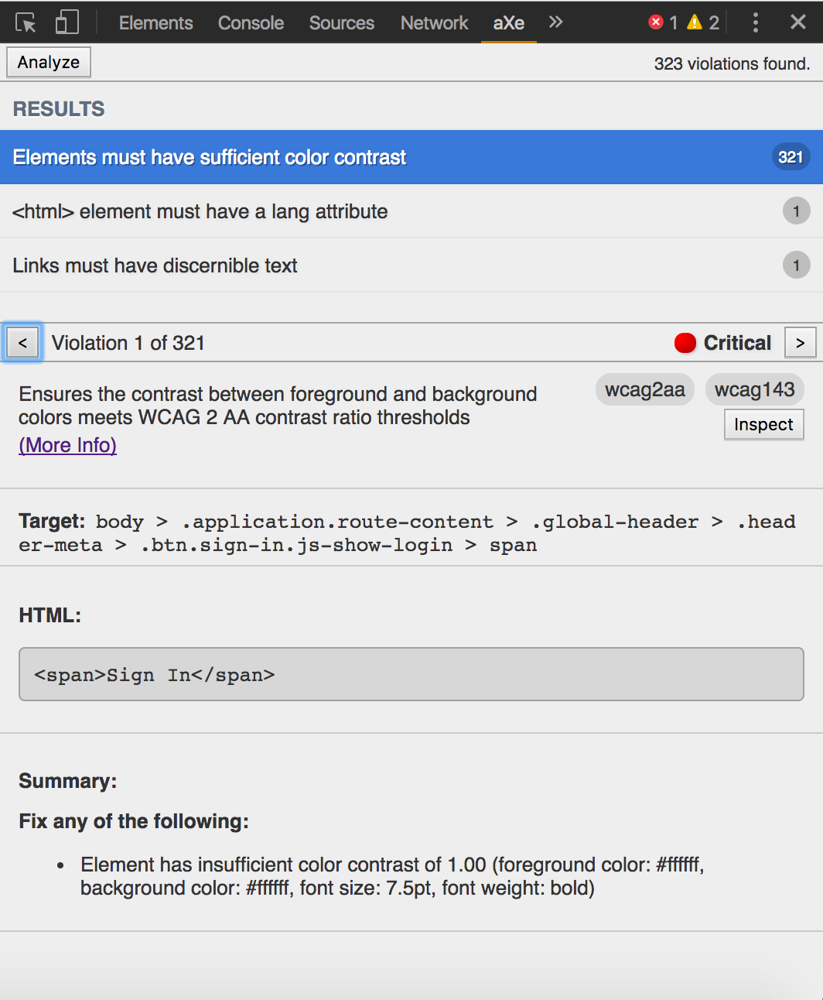
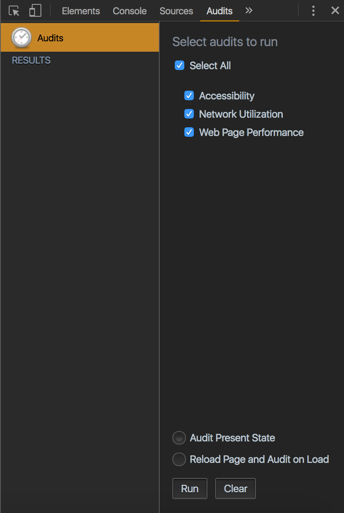

# Accessibility - Make Websites for Everyone

Safari has good developer tools to check for accessibility. Additionally, VoiceOver (screen reader on a Mac) works really well with Safari to identify accessibility issues. The shortcut on a Mac to turn on VoiceOver is `command` + `F5`.

Important to use [WAI-ARIA](https://www.w3.org/TR/wai-aria-1.1/)   (Web Accessibility Initiative - Accessible Rich Internet Applications), a standard set of attributes that you can put in your HTML or SVG to provide accessibility information in your applications.

*Don't make up ARIA attributes since there's a standard set that screen readers are able to decipher*

* Use native semantic tags whenever possible
* Use ARIA roles - specifies what an element does
* Use ARIA labels - specifies a name for the element
* Make elements focusable with `tabindex="0"`

## Add Accessibility Chrome Extenstions

[Accessibility Developer Tools](https://chrome.google.com/webstore/detail/accessibility-developer-t/fpkknkljclfencbdbgkenhalefipecmb?hl=en)  

[Accessibility Inspection](https://gist.github.com/marcysutton/0a42f815878c159517a55e6652e3b23a)

[aXe](https://chrome.google.com/webstore/detail/axe/lhdoppojpmngadmnindnejefpokejbdd?hl=en-US)

## Run Accessibility Audits

